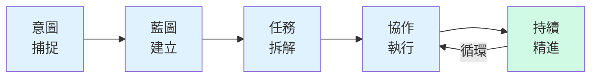
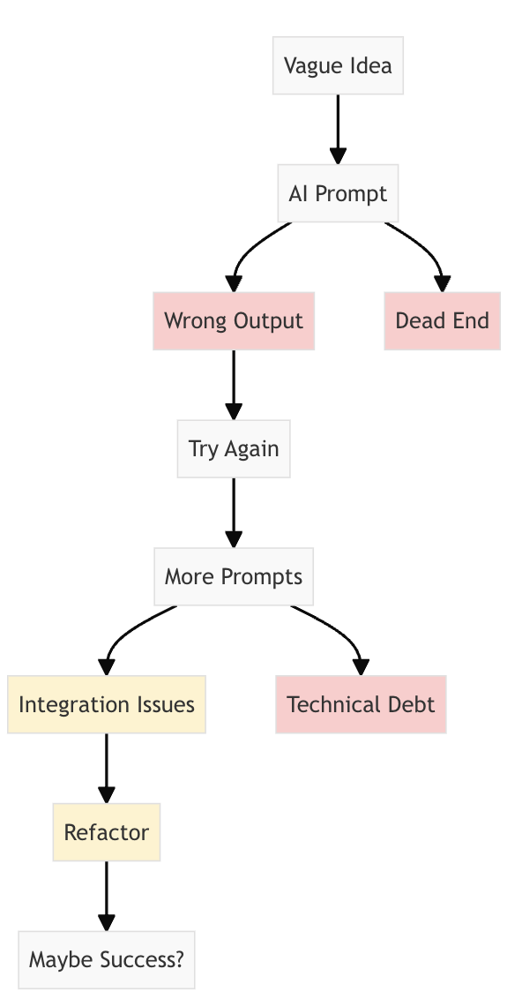
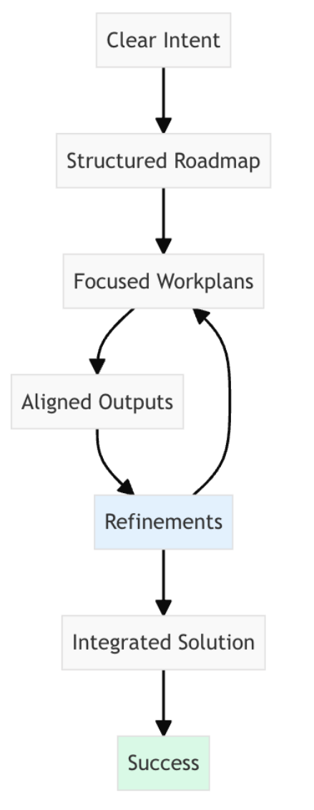

# Specflow：使用軟體代理人建構的結構

> 「先規劃，後執行。每一座偉大的建築都始於藍圖，每一個成功的軟體專案都始於計畫。」

## 🚀 什麼是 Specflow？

Specflow 是一套**結構化但靈活**的流程方法論，專為與 AI 軟體工程代理人共同建構軟體而設計。它將常見的代理人優先開發流程，轉化為系統化、可重複的流程，持續產出符合你願景的成果。

## 問題

目前使用 AI 代理人建構軟體常見的問題：
- 🎯 **意圖落差**－你想要的與 AI 產出的不一致
- 💭 **脈絡遺失**－AI 在多次提示間遺忘進度
- 🧩 **協作混亂**－產出分散且不相容
- ⚡ **效率悖論**－產生速度快但重工繁多

## 解決方案

Specflow 透過五個相互連結的階段，提供結構化流程：

### 📖 五大階段

<table>
<tr>
<td width="20%" align="left"><strong>階段</strong></td>
<td width="30%" align="left"><strong>重點</strong></td>
<td width="50%"><strong>說明</strong></td>
</tr>
<tr>
<td align="left">1️⃣ <strong>意圖</strong></td>
<td><em>目標與動機</em></td>
<td>以明確的目標與動機作為起點，清楚知道要建構什麼及其意義。</td>
</tr>
<tr>
<td align="left">2️⃣ <strong>藍圖</strong></td>
<td><em>里程碑</em></td>
<td>將願景拆分為可管理的階段，每階段有明確目標。</td>
</tr>
<tr>
<td align="left">3️⃣ <strong>任務</strong></td>
<td><em>人機協作</em></td>
<td>將藍圖項目轉化為具體任務，並最佳分配給人類與 AI。</td>
</tr>
<tr>
<td align="left">4️⃣ <strong>執行</strong></td>
<td><em>系統化</em></td>
<td>與軟體工程代理人有系統地完成任務。</td>
</tr>
<tr>
<td align="left">5️⃣ <strong>精進</strong></td>
<td><em>持續改善</em></td>
<td>依據原始意圖檢視產出並持續優化。</td>
</tr>
</table>

## 🎯 誰適合使用？

- **👩‍💻 軟體開發者**－更快建構功能並維持品質
- **📊 產品經理**－有效連結願景與執行
- **🚀 技術領導者**－藉助 AI 擴展團隊產能
- **🤖 AI 愛好者**－精通結構化提示技巧

## 🌟 為什麼選擇 Specflow？

<table>
<tr>
<th align="center">無結構：混亂</th>
<th align="center">有 Specflow：清晰</th>
</tr>
<tr>
<td width="50%" align="center" style="background-color: white;">

</td>
<td width="50%" align="center" style="background-color: white;">

</td>
</tr>
</table>

## 🚀 快速開始

1. **造訪網站**：[www.specflow.com](https://www.specflow.com)
2. **閱讀指南**：從我們的[快速入門指南](https://www.specflow.com/getting-started.html)開始
3. **學習範例**：探索[專案範例](https://www.specflow.com/examples/)
4. **觀看影片**：參考我們的[影片函式庫](https://www.specflow.com/videos.html)

## 🤝 貢獻方式

我們歡迎各界協助完善 Specflow 方法論：

1. **分享你的經驗**－Specflow 如何幫助你的開發？
2. **提出改進建議**－在 issue 中分享你的想法
3. **建立範例**－分享你的 Specflow 專案範例
4. **改善文件**－提交 PR 以提升清晰度

## 📝 重要說明

這不是 SpecFlow.org（已停用的 .NET 測試框架）。他們將規格轉為測試，而我們則透過結構化 AI 協作，將規格轉為可執行軟體。

## 🔗 相關連結

- **網站**：[www.specflow.com](https://www.specflow.com)
- **GitHub**：[github.com/specstoryai/specflow](https://github.com/specstoryai/specflow)
- **創建者**：[SpecStory](https://www.specstory.com)－意圖即新程式碼

## 📄 授權

本專案為開源，採用 [MIT 授權](LICENSE)。

---

*Specflow：使用軟體代理人建構的結構*

---

**免責聲明**：本文件由 [GitHub Copilot](https://docs.github.com/copilot/about-github-copilot/what-is-github-copilot) 翻譯為繁體中文，可能包含錯誤。如發現不適當或錯誤之翻譯，請至 [issue](../../issues) 回報。
